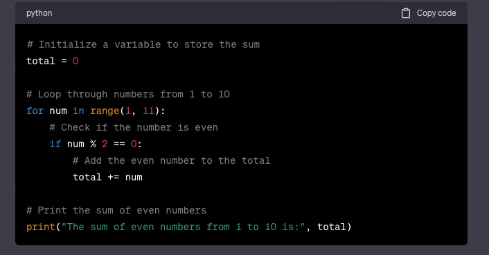

# GitHub Docs Example

## Writing Good Documentation

### Step 1 - Using Codeblocks [<sup>[1]</sup>](#references)

Codeblocks in markdown make it very easy for **tech** people to _copy_, _paste_, _share_ code. [^1]:

A good __Cloud Engineer__ uses _**Codeblocks**_ whenever possible.

Because it allows others to copy and paste their code to replicate or ***research issues***.

in order to create codeblocks in markdown, you need to use three backticks (right above the tab key)

- example using codeblocks with with single quotations is incorrect (')

'''
def factorial(n)
  if n == 0
    return 1
  else
    return n * factorial(n - 1)
  end
end
'''


* example using codeblocks with backticks which is correct (`)

```
def factorial(n)
  if n == 0
    return 1
  else
    return n * factorial(n - 1)
  end
end
```

+ You should attempt to apply syntax highlighting to your codeblocks

```ruby
def factorial(n)
  if n == 0
    return 1
  else
    return n * factorial(n - 1)
  end
# Test the factorial function
puts "Factorial of 5 is #{factorial(5)}"
end
```

+format to add image to you GFM by using 


- to resize image


- good cloud engineers use codeblocks for both code and errors that appear in the console.

> here is an example for using a codeblock for an error that appears in bash.

```bash
# Create a simple Ruby function that raises an error
def divide_by_zero
  5 / 0
end

# Call the function, which will raise a ZeroDivisionError
begin
  divide_by_zero
rescue ZeroDivisionError => e
  puts "An error occurred: #{e.message}"
end
```

## Step 2 - How to take screenshots 

when you can always provide a codeblock instead of a screenshot. if you need to take a screenshot, make sure it is not a photo from your phone

> There are certain cases where it is okay to take photos with your phone, this is when you are showing something like a keyboard, which does not appear on the screen. if it is rendered on your computer screen, then it should be a screenshot.


- A screenshot is whem you capture a part of your screen from your laptop, desktop or phone.
  this is not to be confused with taking a picture with your phone

**Don't do this**


This is what a screenshot from your computer should look like

**Do this instead**




## Step 3 - Use Github Flavored Markdown Task list

Github extends Markdown to have a list where you can check off items <sup> [3] </sup>

- [x] Finish step 1
- [ ] Finish step 2
- [x] Finish step 3
- [x] Finish step 4
- [x] Finish step 5

## Step 4 - Use emojis (optional)
Github Flavoured Markdowns (GFM) supports emojis shortcodes
Here are some examples


| Name  | Shortcode | Emoji|
| ------------- | ------------- | ------------- |
| Cloud  | `:cloud:` | :cloud: |
| Smiling face  | `:smiling_face_with_three_hearts:` |:smiling_face_with_three_hearts:|
| heart eyes | `:heart_eyes:` | :heart_eyes: |

## Step 5 - how to create a table
Github Markdown has it's ways of writing tables, you can use the following markdown format to create tables [<sup> [4] </sup>](#references)
```md
| Name  | Shortcode | Emoji|
| ------------- | ------------- | ------------- |
| Cloud  | `:cloud:` | :cloud: |
| Cloud  | `:cloud:` | :cloud: |
```
Github extends the functionality of Markdown tables to provide more aligment and table cell formatting options.


## Step 6 Another method of adding images to GFM


**How to link a page in github**
[secret window hidden garden](secret-window/hidden.garden.md)

## References 
1. [Basic writing and formatting syntax (Github Flavored Markdown)](https://docs.github.com/en/get-started/writing-on-github/getting-started-with-writing-and-formatting-on-github/basic-writing-and-formatting-syntax) <sup> [1] </sup>
1. [GFM - Emoji Cheat Sheet](https://github.com/ikatyang/emoji-cheat-sheet/blob/master/README.md) <sup> [2] </sup>
1. [GFM - Task Lists](https://docs.github.com/en/get-started/writing-on-github/getting-started-with-writing-and-formatting-on-github/basic-writing-and-formatting-syntax#task-lists) <sup> [3] </sup>
1. [GFM - Writing on GitHub](https://docs.github.com/en/get-started/writing-on-github)
2. [GFM - How to Write Tables](https://github.github.com/gfm/#tables-extension-) <sup> [4] </sup>
[^1]: [GFM - Spec Sheet](https://github.github.com/gfm/)
